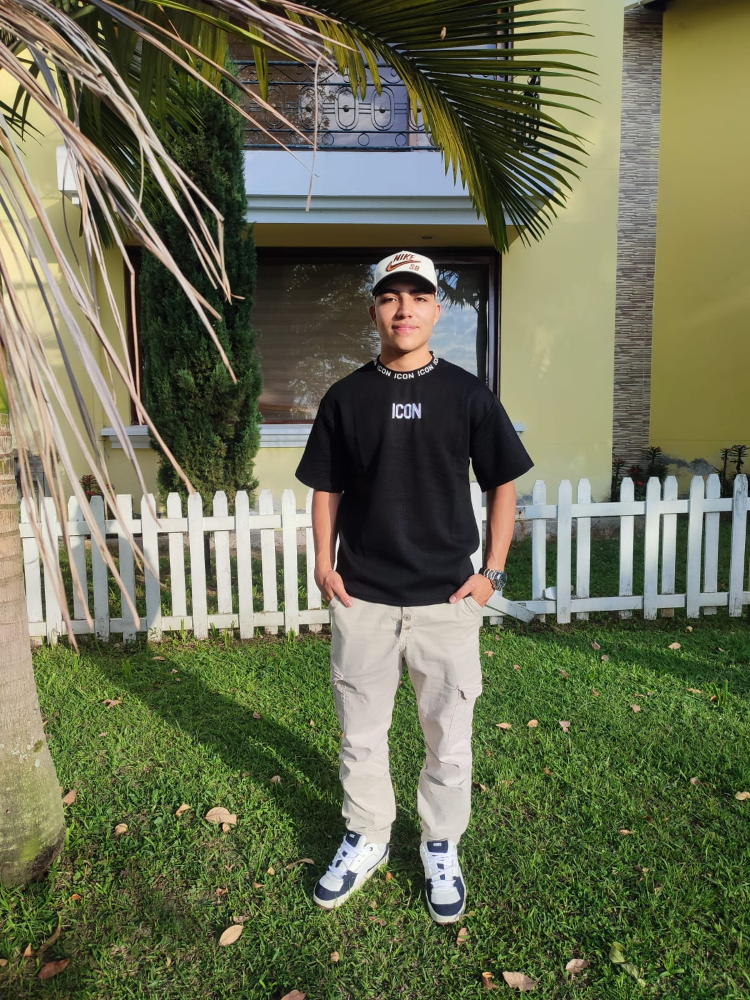

# HOLA BIENVENIDO SOY PABLO SALAZAR

### soy estudiante de ingenieria en sistemas y telecomunicaciones de la universidad de manizales voy en 5 semestre y he aprendido cosas relacionadas con frotend y backend, pero aun asi estoy en constante aprendisaje con nuevas tecnologias

**sobre mi**

me gusta mucho todo lo relacionado con tecnologia, me gusta ir al gimnasio, la naturaleza, me consideo uns persona puntual, capaz de trabajar en equipo y saber relacionarme, anhelo mucho un trabajo relacionado con mi estudio para poder seguir aprendiendo enfocado en lo que me gusta 

# tecnologias que manejo
[] [] [] []

# mis redes sociales

